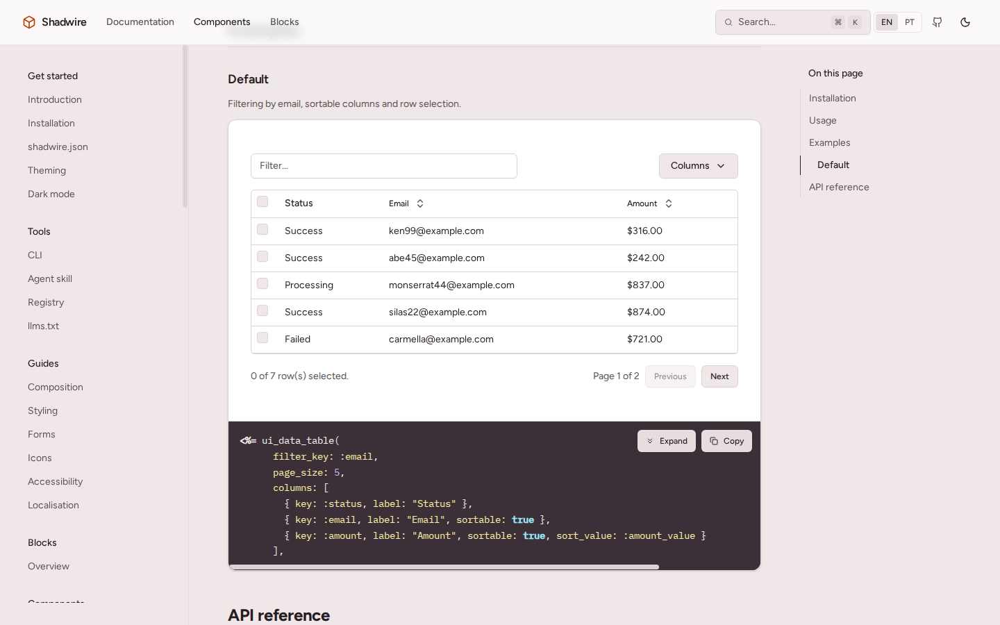
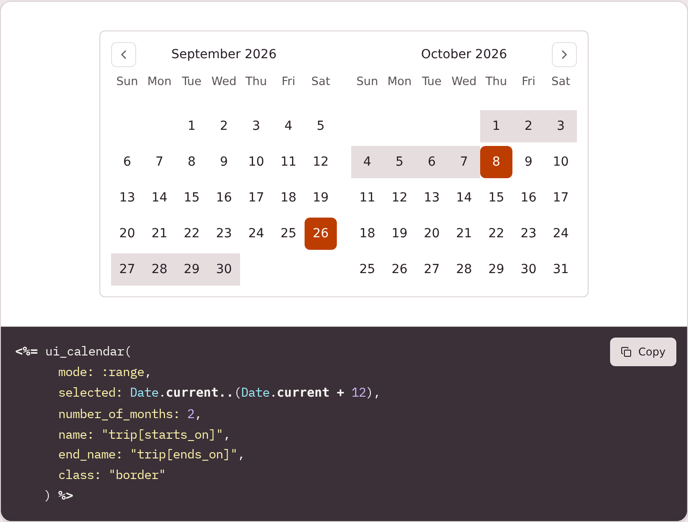
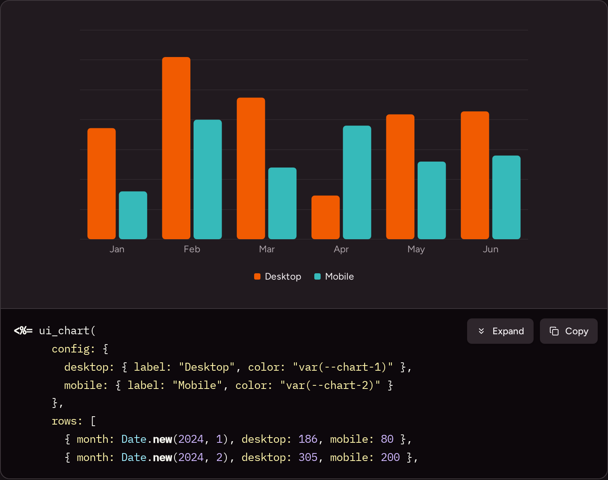

# Shadwire

[](https://rubygems.org/gems/shadwire)
[](https://github.com/edumoraes/shadwire/actions/workflows/ci.yml)
[](LICENSE)

**shadcn/ui for Ruby on Rails.** Shadwire gives you the shadcn/ui components as
ViewComponent classes styled with Tailwind CSS. A CLI copies their source into
your app, and from then on the code is yours: read it, change it, delete what
you don't need.

**[Documentation](https://shadwire.edumoraes.dev.br/docs)** ·
[Components](https://shadwire.edumoraes.dev.br/components) ·
[Em português](https://shadwire.edumoraes.dev.br/pt/docs)



## Why Shadwire?

If you like shadcn/ui but build with Rails, the usual options are a React island
or redoing every component by hand. Shadwire takes the same approach as
shadcn/ui instead: you don't install a component library, you copy its code.

- **The code is yours.** Components land in `app/components/`, not inside a gem.
  When one doesn't do what you need, you edit the file.
- **It's plain Rails.** ViewComponent, view helpers, Tailwind CSS, Stimulus and
  Hotwire. No React, and no JavaScript build step required.
- **Accessible.** Components follow the WAI-ARIA patterns and use native
  elements, like `<dialog>`, wherever they can.
- **Themeable.** Colours come from the same CSS variables shadcn/ui uses, so
  changing the theme or switching to dark mode doesn't touch the components.
- **Updates when you ask.** `bin/shadwire diff` shows what you changed locally,
  and nothing is overwritten until you run `update`.
- **Friendly to coding agents.** An agent skill and `llms.txt` files let Claude
  Code, Cursor and others look up the real API instead of guessing.

## Quick start

You need Ruby 3.2+, Rails 7.1+ and Tailwind CSS v4.

```bash
gem install shadwire
shadwire init                          # once, from the root of your Rails app
bin/shadwire add card button dialog    # any components you want
```

Then use them in any view:

```erb
<%= ui_card do %>
  <%= ui_card_header do %>
    <%= ui_card_title { "Delete project" } %>
    <%= ui_card_description { "This can't be undone." } %>
  <% end %>
  <%= ui_card_footer do %>
    <%= ui_button(variant: :destructive) { "Delete" } %>
  <% end %>
<% end %>
```

`init` adds the `shadwire` gem to your development group. Your app doesn't need
it at runtime: remove it and the installed components keep working. The
[installation guide](https://shadwire.edumoraes.dev.br/docs/installation) covers
the details.

## What's included

More than 50 components and a sidebar layout block, among them:

- **Forms:** field, input, textarea, checkbox, radio group, switch, select,
  combobox, slider, one-time code input, date picker
- **Overlays:** dialog, alert dialog, sheet, drawer, popover, tooltip, hover card
- **Navigation:** sidebar, navigation menu, menubar, breadcrumb, tabs,
  pagination, command palette
- **Data:** table, data table, charts drawn with D3, card, item, badge, avatar
- **Feedback:** alert, toasts, progress, spinner, skeleton, empty state

<p>
  
  
</p>

Every component has a page with live examples and an API reference in the
[catalog](https://shadwire.edumoraes.dev.br/components). From the terminal,
`bin/shadwire list` prints the same list and `bin/shadwire info <name>` shows a
component's API.

## Contributing

Issues and pull requests are welcome. The repository has four parts:

| Folder | What's in it |
| --- | --- |
| `registry/` | The component source. Edit components here. |
| `sandbox/` | A Rails app that tests every component and serves the docs site. |
| `packages/cli/` | The `shadwire` gem. |
| `skills/` | The agent skill. |

After changing a component, copy it into the sandbox and run the tests.
`bin/dev` serves the docs site locally, with your change in it.

```bash
bin/sync_registry
cd sandbox
bin/rails test
bin/dev          # http://localhost:3000
```

The conventions for component code are in [CLAUDE.md](CLAUDE.md), and commit
messages follow [Conventional Commits](https://www.conventionalcommits.org).

## License

MIT. The components you install are yours to change and ship, in commercial or
closed-source products, with no attribution needed in your app.

Shadwire is a port of [shadcn/ui](https://ui.shadcn.com), which is also MIT
licensed. It builds on [ViewComponent](https://viewcomponent.org),
[Lucide](https://lucide.dev) and [D3](https://d3js.org); their notices are in
[NOTICE](NOTICE).
